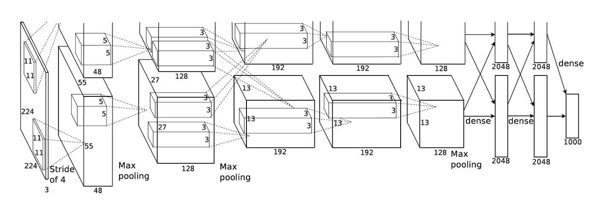
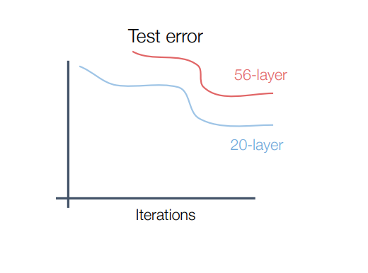
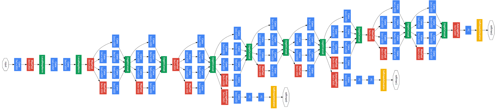
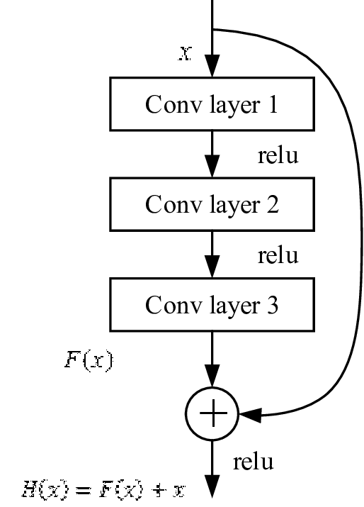

# 2d vision techniqes summary

## Differnet CNN architectures
 

## Alex Net
Alex net was one of the first CNN architectures that ran well and eventually won ImageNet competition in 2012.
Before ALex net the mainstream way of image claasification was t extract feature manually and then train an SVM model on these features, although this method was convenient on some datasets like MNIST.

AlexNet used CNNs in a manner that decreased training time and increased accuracy, it used relu as an activation function which made training faster instead of tanh that satuates and slows down the learning process, also it used max pooling layers that reduced the feature map size meanwhile saving the most important features so the deeper layers focused only on the most important features.

### Main advantages
- Using of relu to add non lineraity and the same time the function does not saturate like tanh
- Using of pooling that increases the size of feature maps meanwhile makes deeper layers focus on the important features
- Using dropout regulraisation to deal with overfitting.

AlexNet bagan the era of CNNs
 
[AlexNet paper](https://proceedings.neurips.cc/paper/4824-imagenet-classification-with-deep-convolutional-neural-networks.pdf)

    

AlexNet architecture

  
  

 ## VGG
 <!-- https://arxiv.org/pdf/1409.1556v6.pdf -->

 After AlexNet there were different attempts to make a better architecture but mostly they were some tweaks and changes to AlexNet and these changes were not in a standard manner so that's why there was a motive to make VGG nets.

 VGG makes use of the fact that the deepr the model the better the accuracy is so it had deeper architecture than AlexNet like VGG16 and VGG19, the idea is that you can make deeper models using the smae order of the layers in VGG19 (conv-conv-pool , conv-conv-pool , etc...) and this will get you better accuracy(until some threshold the model will stop learning and this problem will be fixed in ResNet)

 
 
Also VGG takes advantage of the non linearity convolution layers add by using multiple 1x1 and 3x3 conv layers instead of 7x7 layers and using the same computational power in the same time.

### main advantages
- A more regular way in adding layers to make the model deeper thus get better accuracy
- Adding more non-linearity by using more smaller conv layers and in the same time does not use more computational power.

 

[VGG paper](https://arxiv.org/pdf/1409.1556v6.pdf)

    

VGG19 architecture

  
  

## GoogLeNet: Inception Module
 

[AndrewNG pt1](https://www.youtube.com/watch?v=C86ZXvgpejM&ab_channel=DeepLearningAI)[     AndrewNG pt2](https://www.youtube.com/watch?v=KfV8CJh7hE0&ab_channel=DeepLearningAI)
 
The main goal of this architecture is to go deeper, when VGG nets became deeper it became worse and gave lower accuracy for both training and test sets and that's mainly bacause of vanishing/exploding gradient problem.
 
Also another probblem was which size of the filter in each convolution layer.

    

Test error increases with really deep networks

  
  

### How GoogLeNet solved these problems
- It solved the problem of lower accuracy with bigger network size by using the output of middle layers in the loss function, so the loss function used the output from inner layers with also the output layers which solved the problem of vanishing graidents.
- For the conv size hyper-parameter, GoogLeNet used different conulutions in parrallel and use a combination of these outputs as input to the next step, this bloack is called the `Inception Module`. To minimize the multpilcation operations, 1x1 conv is added before each convlution operation.

 

[GoogLeNet paper](https://arxiv.org/pdf/1409.4842.pdf)

    

GoogLeNet Inception architecture

 

    

meme

  
  

 ## ResNet

 ResNet seems like VVG at the frist glance , it uses the basic structure of conv conv pool but adds to it a forward connection. This new block is called `Residual Block`.
 

    

Residual Block

  
  
 But Why?
  
 As stated before, when the network becomes really deep the accuracy goes down and that's mainly because of the vanishing gradient porblem. But when this forward connection is added this problem is solved

 `H(x)=F(x)+x`
so if vanishing gradient probelm happened and F(x) became zero, H(x) will still have value and the model will continue learning.

### Main Advantages
- This architecture can be extended with many layers in a regular manner.
- It has solved the vanishing rgaident porblem.
- Uses 1x1 convolutin to reduce multiolications and add more non-linearity.
 
[ResNet paper](https://arxiv.org/pdf/1512.03385.pdf)

