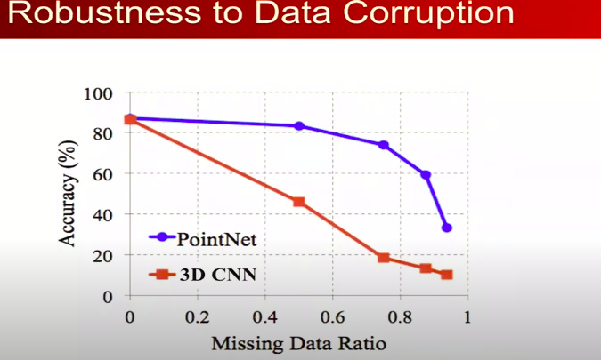
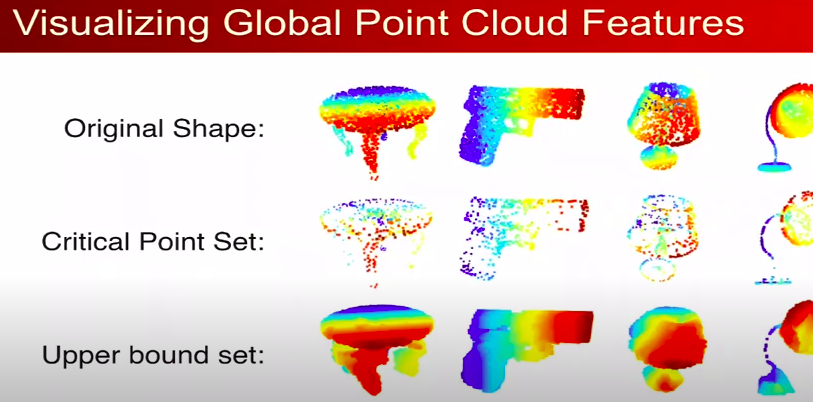

# 3D Detection Techinques
# Just thoughts and notes nothing in detail.

## Camera Technqiues
- Use mono camera and use segmentation techniques to segment the 2d image, extract the contours and by knowing the average aspect ratio of cars and camera charactreristics, we can get the 3d bounding box of the car, this approach is a mix between deep learning and geometrical algorithms and the output is actually an approximation of the 3d bounding box.
- Also another approach is to estimate the depth of objects in the image and generate a fake point cloud and then use lidar based methods on the fake point cloud.
- Stereo Camera can be used for better detection, a famous approach is Stereo R-CNN, which is based on Faster R-CNN. It uses an approch like Faster RCNN where it extracts ROI and then use classification method on these ROIs to classify it, but it does that on the 2 images from the left and right cameras and then integrate them and make Keypoint estimate and stereo regression to estimate the size of the 3d bounding box.

## Lidar Technqiues
- Voxelise the point cloud and then used 3D CNN based methods to detect the objects.
- Use PointNet based methods to detect the objects and use GNN with it, like PointNet. Pointnet is more robust when there are missing points in the point cloud, as it depends on only the critical points that defines the shape of the object, unlike 3D CNNs that depend on all the points.
- Combine the last 2 methods for better results, like PV-RCNN.
<!-- image -->

    

<!-- image caption -->

Robustness Graph

  
<!-- criticalpoints image -->

    

Critical Points

  
  
<!-- point net paper link -->

[PointNet Paper](https://arxiv.org/pdf/1612.00593.pdf)

