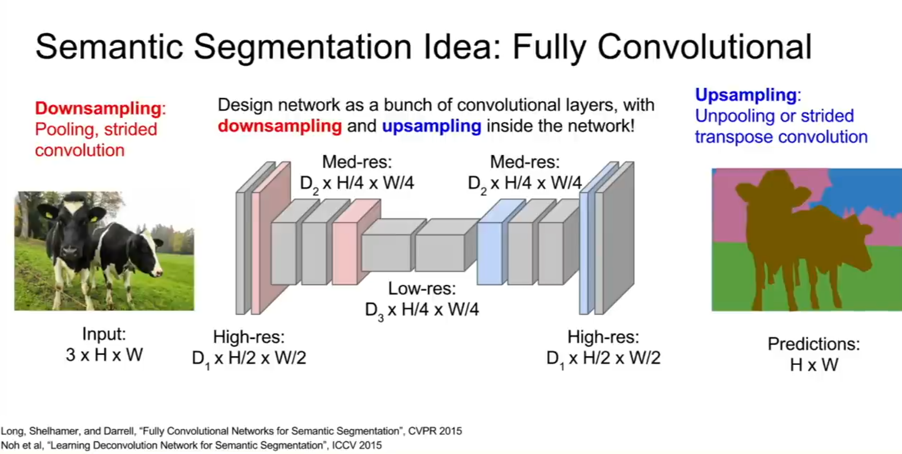
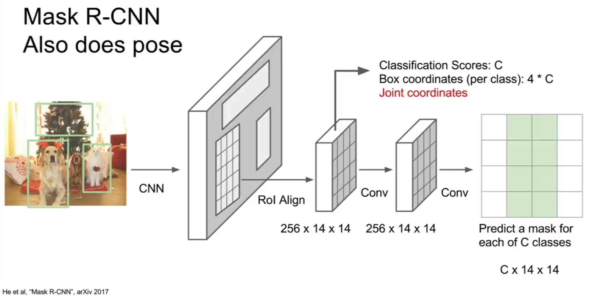

# Segmentation Techinques

## Full Convolutional Semantic Segmentation Networks

The main idea of this approach is to use a CNN to keep reducing the size of thhe image b convolutions and doown sampling layes until the image reaches a downsampled size but each pixel is classified and then upsample the image again. At the end we will be having an image where each pixel is classified and at the same time the forward pass in this CNN is not Computationally expensive.
<!-- image -->

    

Semantic Segmentaion Basic Architecture

  
  
 <!-- paper linnk -->
<a href="https://arxiv.org/pdf/1411.4038.pdf">FCN Paper</a>
     
     

## Mask R-CNN (used for instance segmentation)

Mask R-CNN uses faster RCNN and adds to it in order to use it for segmentation. It adds a mini segmentation network(like the network stated above) to the RCNN architecture to get the mask of the object.
 
To sum it up, after the RCNN puts bounnding boxes around the objects, the mini segmentation network is used to get the mask of the object inside the box.
<!-- image -->

    

Mask R-CNN Architecture

  
  
 <!-- paper linnk -->
<a href="https://arxiv.org/pdf/1703.06870.pdf">Mask R-CNN Paper</a>
     
     

transformers is a
maskfor

<!-- DeConvNet, SegNet,
U-Net and V-Net, HRNet -->
