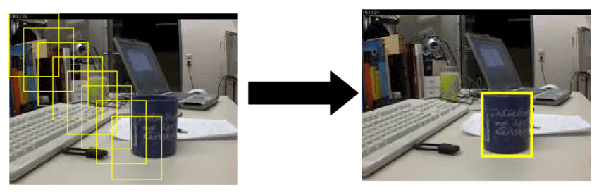
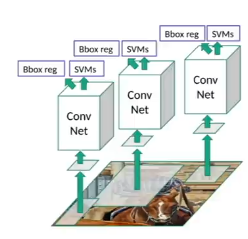
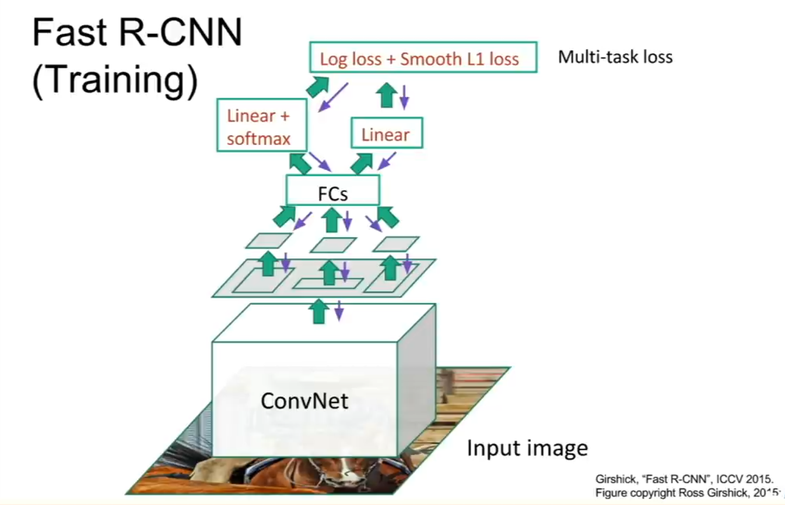

# Detection Techinques

## Noraml CNNs
One of the methods is to train a CNN like VGG or ResNet on datset having both the classifiaction and bounding boxes of the object and the loss function becomes hybrid between the classification problem and the regression problem of the position of hte bounding boxes, the main disadvantage of this method is the the lack of datasets and it's hard to gneralise the model on different secnarios.

## Sliding Windows Approach
This approach from its name slides a window over the picture and classifies the window each time, if a certain class probability exceeds a certain threshold then a bounding box is placed, most probably their will be lts of overlapping bounding boxes so algorithms like non-max suppression are used.
### Main Disadavantages
- Needs high computational power as each part of the image is classified at least one time.
- The windows size is a hyperparameter and in the same picture we may need to slide different windows wiith different sizes.
### Note
There is impleemnation of CNNs thaat embed the sliding window approach within the network itself which makes the process more convenient.

    

Sliding Window

  
  

## R-CNN

### Steps
- Use region proposal algorithm to get the regions of the image that may contain the object, usually the regions are close to 2k region.
- Let the region of interest be resized and enter a CNN(usually they used AlexNet because it was cutting edge back then) and get the feature vector of the region.
- Use the feature vector to train a SVM classifier to classify the region.

### Disadvantages
- The region proposal generates lots of regions which add more runtime to the process as each region eneters the CNN, also it is a seperate algorithm from the CNN so adds more complexity in devloping the model.
- The SVM has to be trained on the features extracted by the CNN so we have to train the CNN at first then the SVM so the training process is not parrallel.
- A single image takes around 47 second to process using VGG16.

    

RCNN Architecture

  
  

## Fast R-CNN
Instead of making an architecture that each module has to be trained alone like R-CNN, Fast R-CNN is trained as a whole.

### Steps:
- use a convolutional network to extract features from the whole image.
- extract the regions of interest from the feature map and aply them to a fully connected layer to get the feature vector of the region.
- use a linear softamax classifier to classify each region of interest, and linear regression block to predict the bounding box of the region.

    

Fast R-CNN Architecture

  
  
 <!-- paper link -->
<a href="https://arxiv.org/pdf/1504.08083.pdf">Fast R-CNN Paper</a>

